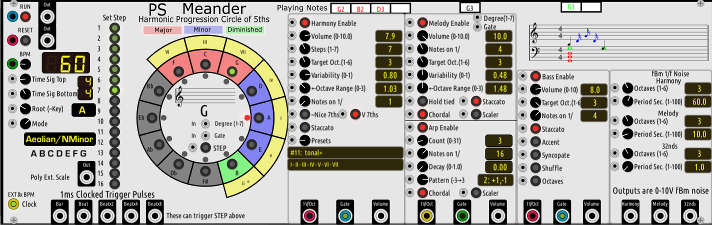

# Meander
Meander plugin module for VCV Rack.   

## Caveat:
Anything I say here about music theory and practice as well as how I have implemented that theory and practice in Meander is my own understanding, which is surely not absolutely correct and musicians might choose to debate with me on that.  There are also a lot of exceptions to the "rules" in music.  If fact, it is these exceptions that give composers and musicians their own distinctive sound.  In the end, it is all about what sounds good or entertaining or evokes certain feelings.  From my perspective, there are no absolute rules in music.  So, take what I say with a grain of salt. 

## Quickstart

Meander is self contained except for actual sound generation.  It has it's own clock, so you do not need to connect a clock generator.  The minimum configuration is to connect the Harmony 1V/Oct output to a polyphonic VCO and the VCO to a mixer or Audio output module.  The sound will not be great, but that is the first step.  Then connect the melody and bass 1V/Oct outputs to their own VCOs.  The melody output is 1 channel monophonic.  The bass output is 1 or 2 channel polyphonic.  The harmony output is 3 or 4 channel polyphonic.  Next steps are to add an ADSR and VCA for each part.  The Meander gate outputs should control the ADSR trigger.  Everything else is just icing on the cake.

## General: 
Meander is fundamentally a musical "expert" system that has quite a few rules for what makes western music sound good and
applies those rules to "sequence" other sound generation modules.  Meander has no audio sound generation or modification capabilities, so even though it is basically a complex application (which Meander is and has been over its 30+ year history), it is lightweight in terms of the load it puts on the CPU and DSP.  Meander has its own internal clock, so no inputs are required in order to start making music.

Meander is limited to western music heptatonic (7) note scales, primarily so that the chord rules can be uniformly applied. Meander is founded on the 7 modes and 12 roots (~keys) for 84 combinations of mode and root.  The Circle of 5ths is the visualization device for seeing the mode and root harmonic intervals.  The proper key signature notation is displayed inside of the circle of 5ths.

The Meander module panel is generated procedurally at runtime, rather than an relying on an SVG file.  It has an SVG file but that only has the logo text.

Only one functional instance of Meander can be loaded from the VCV Rack plugin browser.  If a second or other instance is loaded, the additional instances are disabled and the user is notified of that via a warning on the added panel image.  This is due to the complex issues of porting a large stand alone Windows application to Rack, and the complications of having extensive global memory data and code.

All Meander panel control parameters can be controlled by an external 0-10V CV via the input jack just to the left of each parameter knob or button.  No external control is necessary to use Meander.  The CV control is there to allow you to do (almost) anything you can dream up.

The mode and root are selected by the control knobs on the far left side of the panel.  As you rotate these knobs, the circle of 5ths will rotate to show the chords that should be played for this mode and root. The root will always be at the I degree position and is also designated by a red light just inside of the inner circle. Only the colored segments should be played.  Each colored segment is marked with the chord "degree", which are the Roman numerals I-VII.  The degrees are color coded as to whether the chord will be played as a major, minor or diminished chord.  Major chord degrees are designated with uppercase Roman numerals whereas minor chord degrees are designated with lower case Roman numerals. A diminished chord degree is designated with a lowercase Roman numeral and a superscript "degree" symbol.  All of this is done automatically by Meander, following music theory common practice. 

Meander has 3 main music "parts" sub-panels: Harmony, Melody and Bass. The harmony drives the melody and the bass parts.  The melody drives the arpeggiator (arp) sub-part.  The arepeggiator is a melodic arpeggiator rather than a harmonic arpeggiator.  Each of the parts can be enabled or disabled via the "Enable" buttons at the top of the subpanels.  If the part is not enabled, Meander still composes that part (so that the harmony part is always available to the bass generator) but does not play that part.

Each part has three output ports at the bottom of the panel.  Those are the 1V/octave, the gate and the volume outputs.  The 1v/Oct output is typically  connected to a VCO V/OCT input, whereas the Gate output is typcially connected to an ADSR gate input, which is connected to a VCA. Meander follows the Gate voltage standard, but not the common practice.  The gate off state is 0V.  The gate on state is >=2.1V .  The gate on voltage also carries the volume for the note in the range of 2.1V-10V.  Thus, the gate output can also be used to control volume by modulating a VCA or controlling an ADSR Sustain parameter, or the channel level on a mixer, etc.  The gate could also be used as a CV for anything else you choose to use it for.  The volume output is totally optional for anything you might want to use it for.  It passes the part Volume setting out, but it may also be modulated by such things as bass part note accents.  It can safely be ignored until you become more experienced with Meander.

A big aspect of Meander is that the harmony, melody and bass parts "meander" according to some fairly complex fractal based math.  You do not have to worry about that unless you want to.  Meander uses "fractal Brownian motion" for producing meandering patterns.  The specic type of fBm variation is called 1/f noise and is made up of 1D quintic interpoldated Perlin noise, where the 1-D is time.

Each of the three parts is discussed following in more detail:

## Harmony

Harmony is made up of chords made up of notes from the mode and root that is selected, as well as determined by the current circle of 5ths degree position chord type.  A harmonic progression is the movement on the circle in steps over time.  At the bottom of the Harmony sub-panel is the "Presets" control which allows you to select between 50+ ready-made harmonic progressions.  Each progression is made up of from 1 to 16 steps, designated by the Roman numeral degrees I-VII, corresponding to to the degree positions on the circle for the current mode and root.  I.E., the same progression can be played in any of the 84 mode and root "scales".  As the pogression plays, you can watch the circle and see which chords are playing for each step.  Each preset has an initial number of "steps".  You can manually reduce the number of steps via the "Steps" knob, but you cannot increase it past the max value for that preset. The minimum number of steps is 1.  Sometimes some interesting music can be created by setting the steps to 1, in which case the harmony stays on the root position of the circle, but may still meander through inversions and the melody and bass will follow.

The music theory behind the circle-of-fifths is beyond this manual, but the basic theory is that triad chords next to each other on the colored part of the circle always share one note between them.  Each degree going CW around the circle represents a 5th interval, thus the name circle of fifths. Going CCW, the interval is a 4th.  The shared note between two chords going CW is a 5th above the tonic or root note of the first chord.  Basically, the further away from each other two chords are on the circle, the more dissonance there will be.  A common progression is to start out on the I position and then jump several positions CW on the circle and then walk back CCW on the circle back to the I position.  Each step CCW gives a feeling of resolution of tension back to the I position.  There are a myriad ways to form the progression, but there are a few progressions that almost all popular western music is composed of.  Meander has 50+ such presets.  One of the most common progressions in popular music is I-V-vi-IV , which is #26 in the presets.  That same progression can be played in any of the 84 mode and root combinations, but may have s distinctly different feel in a different mode and root scale.  Not all music is based on chord progressions, but a lot is, particularly popular music.

The fBm fractal noise results in harmony (chord) meandering, by allowing chords to wander over a range from a fraction of an octave to several octaves.  Rather than meandering in octave jumps, the chords meander through chord inversions across one or more octaves.  The playing chords shown inside the circle are in inversion notation if inverted.  If you see a chord such as G/D, that means a Gmaj chord where the G root is played above the D note in the major triad.  These inversions also allow the chord progression around the circle of 5ths to sound less melodic.  These are also two of the reasons that musicians use chord inversions.

The "Chords on 1/ " control determine when the chords play.  1/1=whole note, 1/2=half note, 1/4=quarter note, and so forth.

Harmony notes can be played staccato or legato (default).  Staccato notes have a duration of about half of the interval between the notes.  Legato notes run into each other with no silence between sequential notes.

### Manual Control of the Circle:

You can click on the buttons inside any of the circle of 5ths segments.  When you do this the harmony part stepping is disabled and Meander plays whichever circle degree you clicked on.  Click again on "Harmony Enable" to have Meander resume the progression steps.  You can click on the grayed out circle positions but they will not usually sound pleasant as they are outside of the current circle of 5ths degree members. When you click on a colored degree segment, Meander will also add the melody, arp and bass parts for that chord, if those parts are enabled.

You can also control the circle of 5hs position by using the "Degree" and "Gate" inputs inside of the circle.  You can setup one of two types of degree cntrol.
  - Attach a keyboard (such as TWELVE-KEY module or an external MIDI keyboard via MIDI-CC module and connect the CV and Gate outs from that to the circle CV In inputs.  Pressing any white music key that produces a >= 0V CV  (C4"will also disable the harmony part and will set the circle degree to the following degrees. C=I,D=II,E=III,F=IV,G=V,A=VI and B=VII.  That degree chord will be played at the octave of the key pressed.  Meander will generate the melody, arp and bass from this circle position chord.  You can watch the circle display to see which segment is active and what the actual chord played is.
  - Attach a CV in the range of 1V-7V to both the circle Degree and Gate input.  The voltage will then set the circle to the corresponding degrees 1Volt=I, 2Volt=II, ... 7Volt=VII .  And the chord will be played and Meander will generate the melody, arp and bass parts from that chord.  This CV could come from a sequencer such as MarkovSeq, or it could come from an LFO etc. Again, clicking on "Harmony Enable" will result in Meander resume stepping the progression.
  
  - New for V1.0.3 is a button inside of the circle of 5ths labelled "STEP".  When you cick on this, Harmony progression is disabled and Meander plays the current circle degree chord until you press STEP again, at which time the harmony will advance to next progression step chord for the currently selected harmony preset.  This button also has a CV input jack, you can supply a momentary voltage pulse on this input and the harmony will step, just like by clicking on STEP.  In order to return to automatic harmony/chord progression stepping, click again on "Harmony Enable" to enable the harmony part automatic progression.
  
### Limited Editing (no save) of the progression 

To edit, click on Run to pause Meander playing.  Click on a green "Set Step" button.  Click on circle degree degree buttons until you find one you like as Meander plays your click selections. Click on another Set Step button and repeat the prcess.  You can step through the modified progression by clicking on the lit Set Step buttons sequentially.  At any point you can click on the circle degree buttons to change that step if you do not like it.  Click on Run again and Meander will resume playing and use the edited values for the progression until another preset is selected or you end your Rack session.  A future release of Meander may allow saving of editing progressions.

## Melody

Melody is driven by the harmony part chords.  The melody notes can either be chordal where they are members of the current playing or last played chord, or they can be scaler where they are members of the current scale (mode and root) but not necessarily of the chord.  Meander does not use "accidental" notes that are not members of the current scale.

The "Note Length 1/" control determines whether the melody plays on whole, half, quarter, eighth, sixteenth, or 32nd notes.

There is one parameter button called "Hold tied notes".  This means that the note gate is not retriggered if the note is a repeat of the previous note (the notes are tied).  It is a matter of taste as to how you should set this.  Beware this option is enabled by default and may be why you are not hearing all of the melody notes.

Melody notes can be played staccato (default) or legato as controlled by the gate output.  Staccato notes have a duration of about half of the interval between the notes.  Legato notes run into each other with no silence between sequential notes.

The Arp or Arpeggiator settings are part of the melody.  In an arpeggiation, the melody note is the first note in the arpeggio and the other notes are either chordal (current chord members) or scaler (current scale members) and follow the "Pattern" control of notes moving up or down or up and then down by 0, 1 or 2 notes per step.  The Arp "Count" is the number of arpeggio notes which are separated by 1/n notes.  For example, if the melody note is every 1/4 note, you can fit up to 3 arp notes of 1/16 length between every melody note.  The Arp "Decay" control causes the arp notes volume to decay each note.  It is up to you to make use of the arp note volume by either the melody volume output, or the volume over gate output.

See the harmony section for description of the Note Length, Target Oct. Variability and Octave Range parameters.

## Bass

Bass is driven by the harmony part and does not meander.  The root note of the current or last played chord is used as the bass note.  This note is transposed to the bass "Target Oct."  If bass "Octaves" button is selected, two bass notes an octave apart are played, with the 2nd bass note being an octave above the "Target Oct."  Bass notes are played every 1/n as "Bass on 1/" values in the same way as with the harmony and melody:  1/1=whole note, 1/4= quarter note, etc.

Bass notes can be played staccato (default) or legato.  Staccato notes have a duration of about half of the interval between the notes.  Legato notes run into each other with no silence between sequential notes.

Bass"Accent" and "Syncopate" both require you to use the bass volume or volume over gate to modulate the bass volume per note.  Shuffle is a rhythmic syncopation only and does not requre volume modulation.

## fBm 1/f Noise

This sub-panel allows you to set the parameters for the harmony and melody notes fBm generators.  There are two parameters for each.  "Octaves" determines how many octaves of 1/f noise are created.  The more octaves, the more the fBm varies.  "Period Sec." determines the approximate time period over which the fBm varies.  Harmony is typically set to vary over long periods, with the default at 60 seconds.  Melody typically varies over a shorter time period, with the default being 10 seconds.  The 32nd note fBm paraameters do not determine note meandering but rather are generated and output for user use as CV.  The default for this last is to vary over approximately 1 second.

The fBm sub-panel has 3 CV outputs that range from OV-10.0V.  These are strictly for viewing in a scope module or for using as any type of time varying CV use as the user might desire, such as controlling a VCF, etc.  These output signals are determined by the fBm sub-panel Octaves and Period parameters.  I.E., the Harmony fBm output is typically useful for controlling things over the duration of song or several bars.  The Melody fBM output is typically useful for controlling things within a bar. The 32nd note fBm output has a minimum Period of 1 second and when combined with more Octaves results in a lot of variation over a short time period. The Harmony fBm is output each time a harmony chord is played (or created if harmony is disabled).  Likewise, the melody fBm is output each time a melody note is played.  The arp 32nd note fBm is output once every 1/32nd note.

fBm can safely be ignored until and if you are interested it exlporing the possibilities.  Remember that you can double click on any Meander parameter control knob to restore it to the default values. 

## Score

The upper right portion of the panel is used to display the notes that are playing in standard musical notation on the bass and treble clef staffs. Chord notes are in red, bass notes are in green. Melody notes are in black and arp notes are in blue.  Note, You have to look at the key signature to determine if notes played are sharps or flats.  Since Meander does not allow accidentals, notes are always displayed without sharp or flat designation, even if they are played sharp or flat per the chosen scale.  This is the common practice in musical scores.  The score display displays one measure of notes and then starts over.  Depending on the note lengths per part,there could be many notes displayed per bar.  Meander will limit the number of displayed notes to 256 per bar.

## Clocked Trigger Outputs

Located along the lower left side of the panel are 5 clocked trigger (not clock) outputs.  They are 1ms pulses that occur once per bar, once per beat, twice per beat, four times per beat and eight times per beat.  They can perhaps be uses as clock outputs if the receiving module can handle 1ms clock pulses rather than a square wave.

## Clock In

Located at the extreme bottom left corner of the panel, this accepts an input clock and if connected, overrides Meander's internal clock.  This should be a 1/32 note clock or 8X the beat clock for 4/4 time.  As soon as the clock input is disconnected, Meander will switch over to the internal clock, usually seamlessly.

## Play controls

Meander takes external Run and Reset signals, executes them and passes them to the Meander Run and Reset OUT ports.  Thus, Meander can be started, stopped (paused) and reset by an external clock generator.  Toggling Run does not reset the sequencer in any way. Thus, the Run button can pause Meander and it will resume where you left off when clicked again. Clicking Reset does reset the sequencer and reinitializes everything.  If you click Reset while Run is in the off state, a reinitialization occurs and Meander will start at the beginning of the progression when Run is pressed again.

## General Remarks

Meander does it's best to handle on the fly changes while playing without having noticable glitches or jumps.  Sometimes parameter changes require significant re-setup of scales and chords in Meander.  If for some reason, Meander does not sound quite right after a parameter change, click the Meander Reset which will re-iniitialize everything with the current parameter settings and start the harmonic progression back over at the 1st step.  Changing the harmony progression preset also results in a reset to the 1st step in the progression.

Whereas most harmonic progression presets are deterministic in the degree steps, any preset with "Markov" in the descriptions is stochastic and uses a 1st order Markov transition matrix for the degree steps, with the probabilites reflecting common patterns in the composer's works, if there is a name such as Bach in the description.  As such, whereas these progressions may repeat portions over time, it is unlikely to every play the same progression twice. There are a few other presets that have Rand or Random in their description that does a simpler non-Markov stochastic progression step.

All knob or state buttons can accept an external CV signal to vary the parameter over all allowed values.  The input CV should be from 0V-10.0V .  Meander will normalize the CV input ratio to 0.0-1.0 and then multiply this ratio times the parameter range and add to the minimum value to determine the new parameter value.  Only acceptable values will be set that are a reflection of the configParam() min and max.  The new value is displayed on the panel for your convenience.  If an exernal CV is > 0 V., it has control of the param.  If the external CV is <=0, control is returned to the Meander parameter knobs.  For buttons, the external CV should be 0V for the off state and >=1V for the on state.
