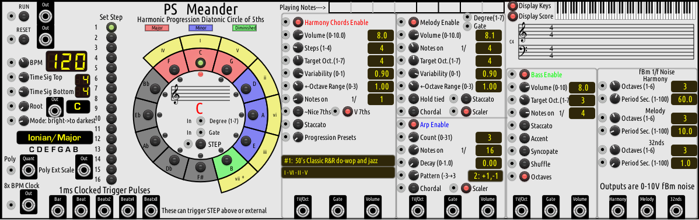
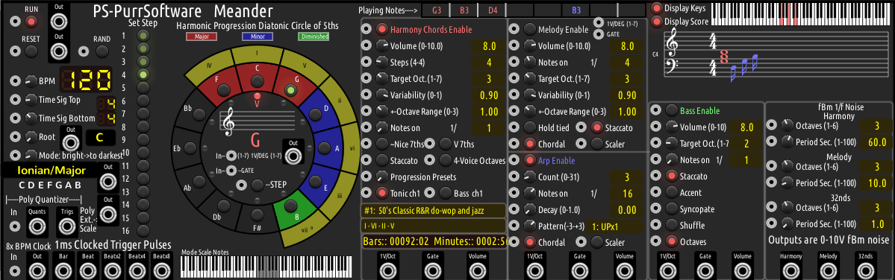
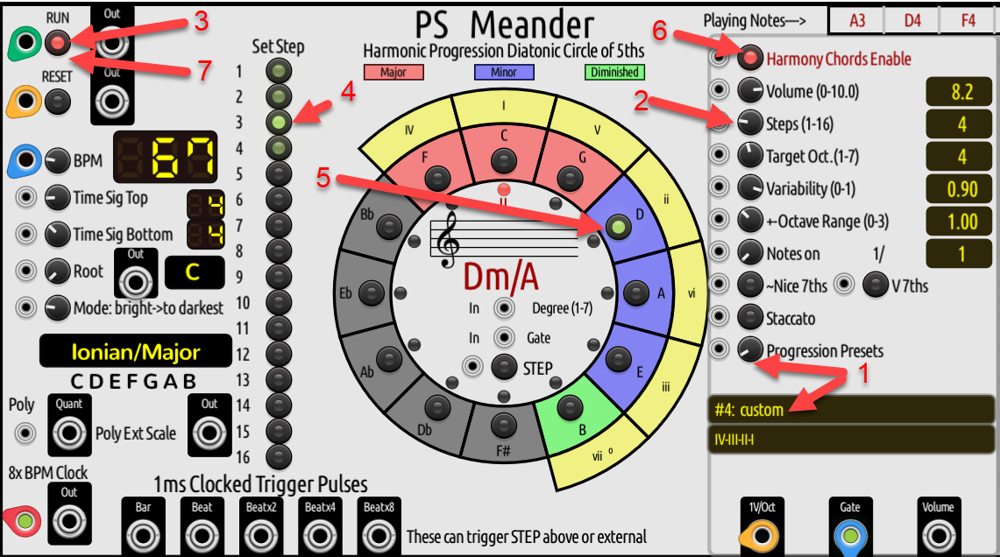
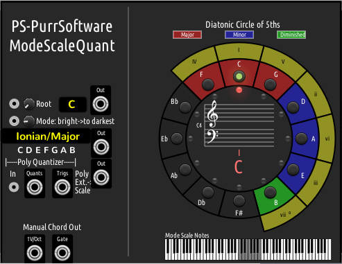

## PS-PurrSoftware plugin V2.0.29 (Nov 2023) for VCV Rack V2. 

## Contents
* [PS-PurrSoftware Change Log](./CHANGELOG.md)

* [Meander Module Manual](#meander-manual) 
* [ModeScaleQuant (MSQ) Module Manual](#modescalequant-manual) 

##   Meander Manual

     
     

* [Meander Progression Presets](#meander-progression-presets)

## Caveat:
Anything I say here about music theory and practice as well as how I have implemented that theory and practice in Meander is my own understanding, which is surely not absolutely correct and musicians might choose to debate with me on that.  There are also a lot of exceptions to the "rules" in music.  If fact, it is these exceptions that give composers and musicians their own distinctive sound.  In the end, it is all about what sounds good or entertaining or evokes certain feelings.  From my perspective, there are no absolute rules in music.  So, take what I say with a grain of salt. 

## Quickstart

Meander is self contained except for actual sound generation.  It has it's own clock, so you do not have to connect an external clock generator, but an external clock gives more control in advanced setup, particularly when Meander is used with other clocked modules.  The minimum configuration is to connect the Harmony 1V/Oct output to a polyphonic VCO and the VCO to a mixer or Audio output module.  The sound will not be great, but that is the first step.  Then connect the melody and bass 1V/Oct outputs to their own VCOs.  The melody output is 1 channel monophonic.  The bass output is 1 or 2 channel polyphonic.  The harmony output is 3 or 4 channel polyphonic.  Next steps are to add an ADSR and VCA for each part if needed.  The Meander gate outputs should control the ADSR trigger.  Everything else is just icing on the cake.

Here is a minimal complexity but fully featured demo patch.  In this, FM-OP has its own ADSR and VCA.

 

## General: 
Meander is fundamentally a musical "expert" system that has quite a few rules for what makes western music sound good and
applies those rules to "sequence" other sound generation modules.  Meander has no audio sound generation or modification capabilities, so even though it is basically a complex application (which Meander is and has been over its 30+ year history), it is lightweight in terms of the load it puts on the CPU and DSP .  Meander has its own internal clock, so no inputs are required in order to start making music.

Is Meander a generative or algorithmic composition engine?  Probably, but I think of it more as an "improvisation system".  I've tried to incorporate elements of how musicians improvise melody against a harmonic progression and bassline.  The melody player might play scale runs, chord note runs and structured scale or chord note riffs or ostinatos in coordination with the harmony lead. Meander uses fBm time correlated noise to give fractal structure to the scale runs and chord arpeggios, while doing its best to sound good (or at least musical).

With the exception of the Poly External Scale output port, discussed in detail below, Meander is limited to western music heptatonic (7) (a.k.a diatonic) note scales, primarily so that the chord rules can be uniformly applied. Meander is founded on the 7 modes and 12 roots (~keys) for 84 combinations of mode and root.  The Circle of 5ths is the visualization device for seeing the mode and root harmonic intervals.  The proper key signature notation is displayed inside of the circle of 5ths.

The Meander module panel is generated procedurally at runtime, rather than an relying on an SVG file.  It has an SVG file but that only has the panel size and background color. As a result, it puts a somewhat higher demand on the GPU than many modules. 

Whereas you only need one Meander module in a patch, beginning with V2.0.15, multiple instances of Meander can be added to a patch via the browser or by duplcating an existing instance.  Meander is no longer a "singleton".  If you change the panel theme or panel contrast for one Meander instance, it changes it for all Meander instances in the patch as well as changes the light/dark theme to match in the browser.  Whereas the PurrSoftware plugin still has some "global data", only the panel theme global variables are shared by multiple instances of Meander in a patch as are a small number of variables that deal with musical values that are shared across Meander instances, wuch as note names.  All other variables and parameters are stored at the Meander module instance level.  That means that any selections and settings you change on a given Meander instance panel are stored at the instance level and are independent from other Meander module instance settings.

Whereas you can now have multiple instances of Meander in a patch now, that is an advanced topic and should probably only be tried once you are familar with the basics of Meander.  Synchronizing the multiple instances is a challenge.  Here are a few suggestions for how to synchronize multiple Meander module instances:
* Use a CLOCKED module with an 8X CLK output as the 8x BPM Clock input on the first Meander instance and the CLOCKED BPM output as the BPM input on the first Meander instance as well as on subsequent Meander instances.  Then run the 8x BPM Clock output from the first Meander instance to the 8x BPM Clock inputs on subsequent Meander instances.  Run the CLOCKED RESET output to the RESET input on each Meander module.  In this setup, each Meander instances will be running at the same clock speed and BPM.
* Use a separate ClOCKED module for each Meander instance.  Set each CLOCKED module BPM to powers of 2 relative settings.  Run the RESET output from the 1st CLOCKED module to the RESET inputs on each subsequent CLOCKED module as well as to the RESET input on each Meander module instance.  Run an X8 CLK output from each CLOCKED module to one of the Meander 8x BPM Clock inputs.  Run the RESET and RUN outputs from the first CLOCKED module to the RESET and RUN inputs on subsequent CLOCKED modules as well as to each Meander module.
* Remember, the multiple Meander modules could be "playing" sound generators at the same time, or their outputs could be switched over time such that at any one time only one of the Meander modules is "playing" sound generators.
* The possibilities are near infinite but will require a deep understanding on how to synchronize the multiple Meander modules in some way that sounds musical or "interesting". You are probably on your own if you go in this direction.

All Meander panel control parameters can be controlled by an external 0-10V CV via the input jack just to the left of each parameter knob or button.  No external control is necessary to use Meander.  The CV control is there to allow you to do (almost) anything you can dream up.  Just be aware that CV parameter control actually changes the value of the param knobs and buttons and the knobs and buttons will change value depending on the CV input.  These are like "motorized controls" available for some high end audio equipment.

The mode and root are selected by the control knobs on the far left side of the panel.  The 7 modes occur in "modal brightness" order with the Lydian mode being the brightest and the Locrian mode being the darkest (with the most flatted scale notes). As you rotate these knobs, the circle of 5ths will rotate to show the chords that should be played for this mode and root. The root will always be at the I degree position and is also designated by a red light just inside of the inner circle. Only the colored segments should be played. Technically, this is a diatonic circle. Each colored segment is marked with the chord "degree", which are the Roman numerals I-VII.  The degrees are color coded as to whether the chord will be played as a major, minor or diminished chord.  Major chord degrees are designated with uppercase Roman numerals whereas minor chord degrees are designated with lower case Roman numerals. A diminished chord degree is designated with a lowercase Roman numeral and a superscript "degree" symbol.  All of this is done automatically by Meander, following music theory common practice. 

With V2.0.24, there are now output ports for both mode and root.  This can be sent to another instance of Meander mode and root input ports for chaining purposes.  Meander detects this behavior and interprets the mode and and root CV values directly rather than via the normal CV input scaling.

New to V2.0.29, Meander defaults to a root note that results in that mode representing scale of white notes only on the piano keyboard.  These are the 7 modes in their purest form. But, you can transpose each mode scale to any root semitone and the setting will persist in the patch until you change the mode again, at which time the root defaults to the standard, which can also then be overriden, etc.  

The modern modes and their default roots are:
-Lydian  	 F,
-Ionian (major)	 C,
-Mixolydian 	 G,
-Dorian		 D,
-Aeolian (minor) A,
-Phrygian	 E,
-Locrian	 B

MSQ mode and root outputs can be connected to other instances of MSQ and/or Meander wuch that one master can set the mode and root for any number of Meander and MSQ instances.  CV can also be used in the mode and root input ports to set the mode and root.  If you want to use CV mode control, you can still have a persistent root override by using explicit CV control of the root also.

Meander (and MSQ) also now have a piano keyboard scale display, which is useful for undertanding the theory behivd modes and roots and the scale signature inside the circle-of-5ths widget as to how the mode is notated with sharps and flats, if any.  Thus, the modal scale (mode with root) notes are displayed in 3 formats, as text below the Mode knob, as stave sharps and flats inside of the circle-of-5ths and as notes on the piano keyboard underneath the cirecl-of-5ths.

Meander has 3 main music "parts" sub-panels: Harmony (chords), Melody and Bass. The harmony drives the melody and the bass parts.  The melody drives the arpeggiator (arp) sub-part.  The arpeggiator is a melodic arpeggiator rather than a harmonic arpeggiator.  Each of the parts can be enabled or disabled via the "Enable" buttons at the top of the subpanels.  If the part is not enabled, Meander still composes that part (so that the harmony part is always available to the bass generator) but does not play that part.

Each part has three output ports at the bottom of the panel.  Those are the 1V/octave, the gate and the volume outputs.  The 1v/Oct output is typically  connected to a VCO V/OCT input, whereas the Gate output is typcially connected to an ADSR gate input, which is connected to a VCA. Meander follows the Gate voltage standard (or optionally via the Meander options menu, a "volume over gate"  format that is not common practice, for which  gate off state is 0V and the gate on state is >=2.1V .  The gate over voltage also carries the volume for the note in the range of 2.1V-10V.  Thus, the gate output can also be used to control volume by modulating a VCA or controlling an ADSR Sustain parameter, or the channel level on a mixer, etc.  The gate could also be used as a CV for anything else you choose to use it for).  The volume output is totally optional for anything you might want to use it for.  It passes the part Volume setting out, but it may also be modulated by such things as bass part note accents.  It can safely be ignored until you become more experienced with Meander.

A big aspect of Meander is that the harmony, melody and bass parts "meander" according to some fairly complex fractal based math.  You do not have to worry about that unless you want to.  Meander uses "fractal Brownian motion" for producing meandering patterns.  The specic type of fBm variation is called 1/f noise and is made up of 1D quintic interpoldated Perlin noise, where the 1-D is time.

Note: Meander uses middle C as C4.  That is denoted on the staves of the score display.

Each of the three parts is discussed following in more detail:

New in V2.0.25, "smart parameter control" has been added for the Melody Arp parameters "Count" and "Notes on 1/".  Basically, when you change the Melody "Notes on 1/N" parameter by any means, the Arp Count and Notes pn parameters will automatically change to values that are compatible with the melody.  For example, if you set Melody "Notes on" parameter to 4, which represents 1/4 notes, the Arp will be set to "Count"=3 and "Notes on 1/" to 16 since 3 1/16 arp notes can fit between each melody 1/4 note, and so forth.  You can manually override the Arp parameters to whatever you want and Meander will do its best to play what you select, but Meander will only sound as many arp notes can fit between two melody notes.  Ths change allows the Melody "Notes On 1/" parameter to be CV seueenced and the Arp notes will follow the melody lead.  It is best to send Melody "Notes on 1/" CVs on bar (measure) boundaries. 

New in V2.0.25, in addition to randomizing parameters from the Meander right-click context menu, you can input a trigger voltage into the "RAND" input jack in the upper left panel area (by RESET or click the RAND button next to the input jack.  It works very well to send a slow clock via a power of 4 divided clock so that parameter randomization will occur on bar (measure) boundaries.  Meander will do its best to not introduce and unexpected glitches upon randmomization.  Note, randomisation will follow the above described amart parameter changes for Melody and Arp note parameters.

Also new in V2.0.25, some parameters are marked internally in the Meander source code to not be "randomizable".  These are typically high level, song level parameters that it it too jarring to randomize while playing without changing the "theme" of the song.  Parameters that are not randomizable include: BPM (tempo), key signature numerator and divisor, Root, Mode, Harmony (chord) Progression Presets along with progression Steps, Target Octaves, Octave Ranges, and fBm Noise parameters.

## Harmony

Harmony is made up of chords made up of notes from the mode and root that is selected, as well as determined by the current circle of 5ths degree position chord type.  A harmonic progression is the movement on the circle in steps over time.  At the bottom of the Harmony sub-panel is the "Presets" control which allows you to select between 80 ready-made harmonic progressions.  Each progression is made up of from 1 to 16 steps, designated by the Roman numeral degrees I-VII, corresponding to to the degree positions on the circle for the current mode and root.  I.E., the same progression can be played in any of the 84 mode and root "scales".  As the pogression plays, you can watch the circle and see which chords are playing for each step.  Each preset has an initial number of "steps".  You can manually reduce the number of steps via the "Steps" knob, but you cannot increase it past the max value for that preset. The minimum number of steps is 1.  Sometimes some interesting music can be created by setting the steps to 1, in which case the harmony stays on the root position of the circle, but may still meander through inversions and the melody and bass will follow.

Technically, Meander uses the "diatonic circle of fifths" rather than the "chromatic circle of fifths". The 7 degrees of the diatonic scale are designated in color on the Meander panel, whereas the 5 remaining degrees of the chromatic scale are rendered in gray. The music theory behind the circle-of-fifths is beyond this manual, but the basic theory is that triad chords next to each other on the colored (diatonic) part of the circle always share one note between them.  Each degree going CW around the circle represents a 5th interval, thus the name circle of fifths. Going CCW, the interval is a 4th.  The shared note between two chords going CW is a 5th above the tonic or root note of the first chord.  Basically, the further away from each other two chords are on the circle, the more dissonance there will be.  A common progression is to start out on the I position and then jump several positions CW on the circle and then walk back CCW on the circle back to the I position.  Each step CCW gives a feeling of resolution of tension back to the I position.  There are a myriad ways to form the progression, but there are a few progressions that almost all popular western music is composed of.  Meander has 80 such presets.  One of the most common progressions in popular music is I-V-vi-IV , which is #26 in the presets.  That same progression can be played in any of the 84 mode and root combinations, but may have s distinctly different feel in a different mode and root scale depending on  the "modal brightness".  Not all music is based on chord progressions, but a lot is, particularly popular music. Most progression based Western music limits the chord progression degrees to the 7 colored diatonic scale positions.  Jazz in particular may play the grayed  chromatic degrees.

Note, whereas the harmonic "degrees" (the Roman numerals) meaning and roles are fixed by definition, other aspects such as "harmonic function" are context, style and composer specific and relative.  In harmonic function analysis, chords are typically grouped using the circle of thirds as tonic, dominant and subdominant functions.  These represent the role (function) of the chord in the harmonic progression.  Different styles of music and different composers tend to have different roles for chords in the progression, such as which chords transition most often to other chords in the progression.  Different classical composers had their own style of harmonic functions that gave them their distinctive sound.  This is also why there are so many variations of popular harmonic progressions, where the harmonic degrees have different functions and contexts.  Meander for Windows made use of harmonic function nomenclature but since that was really just specific to classical music common practice era, I have dropped terms such as tonic, dominant and subdominant from Meander for VCV Rack.  In Meander, the harmonic progression steps are designated as upper case Roman numerals.  Note, the standard practice is to show major chord degrees as upper case Roman and minor chord degrees as lower case Roman, but since the degrees may be major, or minor or diminished depending on the mode and root selected, only upper case Roman is used in Meander except on the circle of 5ths where the degrees will be displayed as upper or lowercase Roman numerals correctly per the current root and mode.

The fBm fractal noise results in harmony (chord) meandering, by allowing chords to wander over a range from a fraction of an octave to several octaves.  Rather than meandering in octave jumps, the chords meander through chord inversions across one or more octaves.  The playing chords shown inside the circle are in inversion notation if inverted.  If you see a chord such as G/D, that means a Gmaj chord where the G root is played above the D note in the major triad.  These inversions also allow the chord progression around the circle of 5ths to sound less melodic or chromatic.  These are also two of the reasons that musicians use chord inversions.

The "Chords on 1/ " control determine when the chords play.  1/1=whole note, 1/2=half note, 1/4=quarter note, and so forth.

Harmony notes can be played staccato or legato (default).  Staccato notes have a duration of about half of the interval between the notes.  Legato notes may in some cases run into each other with no silence between sequential notes, but Meander attempts to play staccato notes with a gate of 50% of the time between notes, whereas legato notes are played with a gate of 95% of the time between notes.

New in V2.0.24, you can now select 4 note "octaves" chords.  In this option, to root or tonic of the chord is raised an octave and added to the triad chord notes.  Chords can be selected as "Nice 7ths", "V 7ths", or "Octaves" which each may output 4 note chords.  If none of these types are selected, 3 note triads are played.  Octave chords are useful for doing 4-voice harmony.

New in V2.0.24, you can now select "Tonic Ch1" or "Bass Ch1".  In the first, the tonic or root of the chord will always be on channel 1.  In the second, the bass note will always be on channel 1.  This is needed in case you want to do something predicatable with the tonic or bass notes such as create a bass line.  This is needed since Meander uses chord inversions extensively which means that the lowest note may not always be the tonic.  Note, Meander will correctly handle this situation when it creates the Bass part, but you can do other things with this output if you desire.  Note, the chords will sound the same regardless of whether the tonic or the bass note is on Ch1.  If there is no inversion, the tonic is the bass note and is on Ch1.  If there is an inverseion such as C/E, E is the bass note and on Ch1, etc.

### Manual Control of the harmony Circle:

You can click on the buttons inside any of the circle of 5ths segments.  When you do this the harmony part stepping is disabled and Meander plays whichever circle degree you clicked on.  Click again on "Harmony Enable" to have Meander resume the progression steps.  You can click on the grayed out circle positions but they will not usually sound pleasant as they are outside of the current circle of 5ths degree members. When you click on a colored degree segment, Meander will also add the melody, arp and bass parts for that chord, if those parts are enabled.

You can also control the harmony circle of 5ths position by using the "1V/DEG" and "GATE" inputs inside of the circle.  You can set up one of two types of degree control.
  - Attach a keyboard (such as TWELVE-KEY module or an external MIDI keyboard via MIDI-CC module and connect the CV and Gate outs from that to the circle CV In 1V/DEG and  GATEe inputs.  Pressing any white music key will also disable the harmony part and will set the circle degree to the following degrees. C=I,D=II,E=III,F=IV,G=V,A=VI and B=VII.  That degree chord will be played at the octave of the key pressed.  Meander will generate the melody, arp and bass from this circle position chord.  You can watch the circle display to see which segment is active and what the actual chord played is.  Chord inversions are not used in this mode.
  - Or, attach a single CV in the range 0.0V-7.7V to BOTH the circle 1V/DEG and GATE inputs.  Connecting in this manner allows Meander to recognize that degree and octave will control the harmony rather than a MIDI/Rack 1V/octave keyboard. Typically you will want to set up a sequencer such as SEQ-3 to sequence the Meander harmony.  Do not connect the sequencer Gate to the Meander harmony circle gate.  In this mode, the sequencer values should be entered in an octal radix degree.octave format.  The degree can vary from 0 to 7 and the octave can vary from 0 to 7.  A value of 0.0 is ignored as a sequencer slot skip step.  The voltage will then set the circle to the corresponding harmonic degrees 1.x Volt=I, 2.x Volt=II, ... 7.x Volt=VII .  In many cases you can just enter the values of 1.0 to 7.0 since the .x octave is added to the Meander harmony "Target Octave" parameter value. The chord will be played and Meander will generate the melody, arp and bass parts from that chord.   Again, clicking on "Harmony Enable" will result in Meander resume stepping the progression.  It is not recommended to feed a continuously varying CV to the 1V/DEG and GATE inputs as that will just result in a mess of degrees and octaves.  If you have two adjacent steps with the same degree. it is recommended that you change the octal radix degree and octave value to an octave higher on the 2nd such step, so proper triggering will occur.  For example, if you want two "I" steps adjacent to each other, enter the first as 1.0V and the second as 1.1V  See next section for changes.

New harmony octal radix degree sequencing behavior for V2.0.28: 
A voltage of <=0.0 or >= 8.0 will cause the step note to be skipped.
A voltage of > 0.0 and < 1.0 will cause the previous step note to be repeated. 0.5 is a good value to use, but if you have two or more steps with the same nmote to be repeated, use two (or more) different voltages such as 0.5 and 0.6 so that the note is properly repeated.  It is no longer necessary to use an octave shift to repeat the same note.
  
  - New for V1.0.3 is a button inside of the circle of 5ths labelled "STEP".  When you cick on this, Harmony progression is disabled and Meander plays the current circle degree chord until you press STEP again, at which time the harmony will advance to next progression step chord for the currently selected harmony preset.  This button also has a CV input jack, you can supply a momentary voltage pulse on this input and the harmony will step, just like by clicking on STEP.  In order to return to automatic harmony/chord progression stepping, click again on "Harmony Enable" to enable the harmony part automatic progression.  
  
### #4 Custom progression preset editing (New in V2.0.20)

 

  - "1)" Set the harmonic progression "Progression Presets" preset knob to "#4 custom".
  - "2)" Set the Harmony Chords number of steps as desired, from 1 to 16.
  - "3)" Click on RUN to pause Meander playing and enter the edit mode. 
  - "4)" Click on a green "Set Step" button.  
  - "5)" Click on circle degree buttons in the circle red, blue or green annular ring segments until you find one you like as Meander plays your click                    selections. 
  -    Click on another Set Step button and repeat the prcess.  
  -    While editing, you can step through the modified progression by clicking on the lit Set Step buttons sequentially.  At any point you can click on the            circle     degree buttons     to change that step if you do not like it.  
  - "6)" Click on "Harmony Chords Enable" button if it is not enabled.  Note, clicking buttons inside of the circle of 5th automatically disables the Harmony            Chords Enable button.
  - "7)" Click on RUN again and Meander will resume playing and use the edited values for the progression.
  - "8)" Save your patch and the custom harmonic progression will be saved into the patch file via JSON data.
  - Do not change the "Progression Presets" knob after creating a custom progression as the custom data will be lost.  If you inadvertently change the               progression setting, immediately do a reload of your patch to reload the saved custom data.

A best practics is to set up a new patch or save an existing patch as a new name and then do your custom editing and use in that patch and never touch the Progression Presets knob in that instance of Meander in the patch.  Note, you can have multiple instances of Meander in a patch and each instance can have its own custom harmonic progression.

### Output of "Harmonic Degree" from the harmony Circle:

Just as the circle of 5ths Harmonic Degree can be controlled via CV input in 1V/DEG form, the same informtion can be sent out from the Meander circle of 5ths in 1V/DEG form, either in the range of "1.0v = I, 2.0v = II, ... , 7.0v=VII" or  "0.0v = I, 1.0v = II, ... , 6.0v=VII" with the two ranges selectable in the Meander right click options menu.  
  
The 1.0v-7.0v option is the default and this can be sent to the circle 1V/DEG input on a 2nd Meander instance so that the first Meander instance can sequence the harmonic progression on the 2nd Meander instance.  Ideally, the two Meander instances would be set to the same mode and root scales, but this is not required, but advised to avoid horrible dissonances. 

The 0.0v-6.0v option can be selected to send the harmonic degree to any module that understands degrees and expects 0-6v.  Currently, only the Aaron Static DiatonicCV module understands harmonic degrees and expects them in the 0-6v range.  If you do this, you will need to use the Aaron Static ScaleCV module which you should manually set to the Meander root and mode.  The "Scale Out" fron ScaleCV should be sent to the DiatonicCV "Scale In".  Doing so will allow you to explore all of the Aaron Static chord types, inversions and voicings in musical scale sync with Meander.

Here are some CV values that will change Harmony parameters to meaningful "eigenvalues".  I.E., these voltages can be put in a sequencer in order to sequence the Harmony note lengths on nice bar boundary clock ticks.

	Notes on:	1/N  		CV
			1/1		1.5v	
			1/2		3.5v
			1/4		7.5v
			1/8		9.5v

## Melody

Melody is driven by the harmony part chords.  The melody notes can either be chordal where they are members of the current playing or last played chord, or they can be scaler where they are members of the current scale (mode and root) but not necessarily of the chord.  Meander does not use "accidental" notes that are not members of the current scale.

The "Note Length 1/" control determines whether the melody plays on whole, half, quarter, eighth, sixteenth, or 32nd notes.

There is one parameter button called "Hold tied notes".  This means that the note gate is not retriggered if the note is a repeat of the previous note (the notes are tied).  It is a matter of taste as to how you should set this.  Beware this option is enabled by default and may be why you are not hearing all of the melody notes.  I recommend not using this as more recent changes to the staccato and legato note lengths may result in the hold on tied notes not working.  

Melody notes can be played staccato (default) or legato as controlled by the gate output.  Staccato notes have a duration of about half of the interval between the notes.  Legato notes may run into each other with no silence between sequential notes in some cases, but the programmed behavior is to play legato notes at 95% the length of the time between notes.

The Arp or Arpeggiator settings are part of the melody.  In an arpeggiation, the melody note is the first note in the arpeggio and the other notes are either chordal (current chord members) or scaler (current scale members) and follow the "Pattern" control of notes moving up or down or up and then down by 0, 1 or 2 notes per step.  The Arp "Count" is the number of arpeggio notes which are separated by 1/n notes.  For example, if the melody note is every 1/4 note, you can fit up to 3 arp notes of 1/16 length between every melody note.  The Arp "Decay" control causes the arp notes volume to decay each note.  It is up to you to make use of the arp note volume by either the melody volume output, or the volume over gate output.

See the harmony section for description of the Note Length, Target Oct. Variability and Octave Range parameters.

### Manual control of the melody

New for V1.0.5, you can also control the monophonic melody by using the "1V/DEG" and "GATE" inputs to the right of the melody enable button.  You can set up one of two types of scale degree control.
  - Attach a keyboard (such as TWELVE-KEY module or an external MIDI keyboard via MIDI-CC module and connect the  CV and Gate outs from that to the melody CV 1V /Deg and  Gate inputs.  Pressing any white music key will also disable the melody part and will set the melody note  to the following scale degrees. C=1st, D=2nd, E=3rd, F=4th, G=5th, A=6th and B=7th.  That scale degree note will be played at the octave of the key pressed in the currently selected mode and root scale. Thus you can play in the current scale using just the white notes of the keyboard. The C key will always begin the scale on the current root note. To resume automatic "melody" generation, disconnect the Degree and Gate inputs to melody and re-enable the melody.
  - Or, attach a single CV in the range 0.0V-7.7V to BOTH  the melody 1V/DEG and GATE inputs.  Connecting in this manner allows Meander to recognize that degree and octave will control the melody rather than a MIDI/Rack 1V/octave keyboard. Typically you will want to set up a sequencer such as SEQ-3 to sequence the Meander melody.  In this mode, the sequence values should be entered in an octal radix degree.octave format.  The degree can vary from 0 to 7 and the octave can vary from 0 to 7.  A value of 0.x is ignored as a sequencer slot skip step.  The voltage will then set the melody  to the corresponding scale degrees 1.x Volt=1st, 2.x Volt=2nd, ... 7.x Volt=7th .  In many cases you can just enter the values of 1.0 to 7.0 since the .x octave is added to the Meander melody "Target Octave" parameter value. The melody note will be played in the currently selected mode and root scale.  If you want to have two melody steps with the same degree, it recommended that you set up the second such step as an octave higher.  For example, if you want to sequence two "I" degree steps, set the first to 1.0V and the second to 1.1V .  Again, to resume automatic "melody" generation, disconnect the Degree and Gate inputs to melody and re-enable the melody.  It is not recommended to feed a continuously varying CV to the 1V/DEG and GATE inputs as that will just result in a mess of degrees and octaves.

New melody octal radix degree sequencing behavior for V2.0.28: 
A voltage of <=0.0 or >= 8.0 will cause the step note to be skipped.
A voltage of > 0.0 and < 1.0 will cause the previous step note to be repeated. 0.5 is a good value to use, but if you have two or more steps with the same nmote to be repeated, use two (or more) different voltages such as 0.5 and 0.6 so that the note is properly repeated.  It is no longer necessary to use an octave shift to repeat the same note.
  
Here are some CV values that will change Melody parameters to meaningful "eigenvalues".  I.E., these voltages can be put in a sequencer in order to sequence the Melody note lengths on nice bar boundary clock ticks.

	Notes on:	1/N  		CV
			1/1		1.5v	
			1/2		3.0v
			1/4		4.0v
			1/8		6.0v
			1/16 		8.0v
			1/32		9.5v
			
Here are some CV values that will change Arp parameters to meaningful "eigenvalues".  I.E., these voltages can be put in a sequencer in order to sequence the Arp note lengths on nice bar boundary clock ticks.

	Notes on:	1/N  		CV
			1/4		1.0v
			1/8		4.0v	
			1/16		7.0v	
			1/32		9.5v
			
	Count:		0		0.0v
			1		0.5v
			2		0.75v
			3		1.25v
			4		1.50v
			5		1.75v
			6		2.00v
			7		2.50v
			
	Pattern:	UPx1,DNx1	9.5v
			UPx1		7.5v 	
			Echo		5.0v
			DNx1		2.5v
			DNx1,UPx1	1.5v
						
			

## Bass

Bass is driven by the harmony part and does not meander.  The root note of the current or last played chord is used as the bass note.  This note is transposed to the bass "Target Oct."  If bass "Octaves" button is selected, two bass notes an octave apart are played, with the 2nd bass note being an octave above the "Target Oct."  Bass notes are played every 1/n as "Bass on 1/" values in the same way as with the harmony and melody:  1/1=whole note, 1/4= quarter note, etc.

Bass notes can be played staccato (default) or legato.  Staccato notes have a duration of about half of the interval between the notes.  Legato notes may run into each other with no silence between sequential notes in some cases, but the desgined behavior is for staccato notes to play at a gate length 50% of the time betweem notes and legato notes to play at a gate length of 95% of the time between notes. .

Bass"Accent" and "Syncopate" both require you to use the bass volume or volume over gate to modulate the bass volume per note.  Shuffle is a rhythmic syncopation only and does not requre volume modulation.

Here are some CV values that will change Bass parameters to meaningful "eigenvalues".  I.E., these voltages can be put in a sequencer in order to sequence the Bass note lengths on nice bar boundary clock ticks.

	Notes on:	1/N  	CV
			1/1	1.5v	
			1/2	3.5v
			1/4	7.5v
			1/8	9.5v
			

## fBm 1/f Noise

This sub-panel allows you to set the parameters for the harmony and melody notes fBm generators.  There are two parameters for each.  "Octaves" determines how many octaves of 1/f noise are created.  The more octaves, the more the fBm varies.  "Period Sec." determines the approximate time period over which the fBm varies.  Harmony is typically set to vary over long periods, with the default at 60 seconds.  Melody typically varies over a shorter time period, with the default being 10 seconds.  The 32nd note fBm paraameters do not determine note meandering but rather are generated and output for user use as CV.  The default for this last is to vary over approximately 1 second.

The fBm sub-panel has 3 CV outputs that range from OV-10.0V.  These are strictly for viewing in a scope module or for using as any type of time varying CV use as the user might desire, such as controlling a VCF, etc.  These output signals are determined by the fBm sub-panel Octaves and Period parameters.  I.E., the Harmony fBm output is typically useful for controlling things over the duration of song or several bars.  The Melody fBM output is typically useful for controlling things within a bar. The 32nd note fBm output has a minimum Period of 1 second and when combined with more Octaves results in a lot of variation over a short time period. The Harmony fBm is output each time a harmony chord is played (or created if harmony is disabled).  Likewise, the melody fBm is output each time a melody note is played.  The arp 32nd note fBm is output once every 1/32nd note.

fBm can safely be ignored until and if you are interested it exlporing the possibilities.  Remember that you can double click on any Meander parameter control knob to restore it to the default values. 

## Score

The upper-mid-right portion of the panel is used to display the notes that are playing in standard musical notation on the bass and treble clef staffs. Middle C is designated as C4. Chord notes are in red, bass notes are in green. Melody notes are in black and arp notes are in blue.  Note, You have to look at the key signature to determine if notes played are sharps or flats.  Since Meander does not allow accidentals, notes are always displayed without sharp or flat designation, even if they are played sharp or flat per the chosen scale.  This is the common practice in musical scores.  The score display displays one measure of notes and then starts over.  Depending on the note lengths per part,there could be many notes displayed per bar.  Meander will limit the number of displayed notes to 256 per bar. If desired, this display can be toggled on and off via the score "enable" button.

## Piano Keyboard Display

In the upper right portion of the keyboard is an 88 key piano keyboard.  Following the same rules as for the "score" display, the harmony, melody, arpeggiation and bass notes that are currently playing are rendered in their correct octaves on the piano keyboard.  If desired, this display can be toggled on and off via the keyboard "enable" button.  Note, Meander (MIDI) notes run from 0 to 127 but only the notes from 21 (A0) to 108 (C8) can be displayed on the 88 key piano keyboard, so some low or high notes may play but not be shown as playing on the piano keyboard.

## Clocked Trigger Outputs

Located along the lower left side of the panel are 5 clocked trigger (not clock) outputs.  They are 1ms pulses that occur once per bar, once per beat, twice per beat, four times per beat and eight times per beat.  They can perhaps be used as clock outputs if the receiving module can handle 1ms clock pulses rather than a square wave.  These triggers can also be routed to the harmony circle "STEP" input and the currently selected harmonic progression preset steps will be advanced at that rate, which can vary from quite slow to quite fast.

## Clock In

Located at the extreme bottom left corner of the panel, this accepts an input clock and if connected, overrides Meander's internal clock.  This should be a 8X the BPM clock and should be in VCV Rack 1v/octave BPM format.  As soon as the clock input is disconnected, Meander will switch over to the internal clock, usually seamlessly.  An external clock such as Impromptu CLOCKED is recommended with 8X "RATIO" and with outputs RESET, RUN, BPM and the clock connected to the Meander RUN, RESET, BPM and Clock inputs.  The BPM connection is required so that Meander can understand the 8X clock speed and the time signature setting relationships. Note, this BPM input must be in CV 1v/oct format with 0V=120 BPM. If you do not connect the CLOCKED BPM outout to Meander, you should manually set the Meander BPM knob to the same BPM setting as the clock BPM.  If you are using the Meander internal clock, you should not connect the CLOCKED BPM output to Meander.  You can still connect the external clock RUN and RESET connections to Meander in such a case.  Other clock modules than  Impromptu CLOCKED can be used, but may not fully support Meander.  Clocks do not in general understand time signatures, so this all gets tricky.  You can use other ratios than 8x sometimes, but the note lengths in Meander may not be correct. Use other than 8x clocks if it meets your needs and sounds good.  The internal Meander clock is recommended for getting started and for very simple patches.  For more complicated patches, it is best to use an external clock so that clock can also send to other modules that need a clock and all clocks need to be synchronized.  Meander now has a clock output which is at 8X the BPM as is the clock input.  In general these represent one clock pulse per 32nd note.

Note: The preceding is based on running Meander clocked via Impromptu CLOCKED in standalone mode.  If you want to clock CLOCKED via external BPM input, you need to set the CLOCKED BPM mode to P4 or P24 or whatever your external clock supplies.  These are "pulses per quarter note" or PPQN. Then you should right click to bring up the CLOCKED options menu and enable “BPM out is CV when ext. sync”.  This causes CLOCKED to output BPM as CV, which is what Meander requires for BPM input. All other connections mentioned above still apply.

As of V2.0.21, Meander supports BPM of 3.75-960 BPM via BPM parameter knob or CV input.  The full range is available if you are using Meander's internal clock, but if, for example, CLOCKED is used, Meander is limited to the CLOCKED BPM range of 30-300 BPM.  Technically you could still use CLOCKED for the master clock and raise or lower the CLOCKED BPM output up or down in 1V/oct increments and feed to Meander, but you will also need to double or halve the CLOCKED 8X clock rate that feeds into Meander's 8X clock input with lowering or doubling the BPM by an octave.  This is an advanced topic.  For example, since the CLOCKED BPM output is based on 120 BPM at 0V, subtracting 1V from the BPM voltage drops the BPM by 1 octave, to 60 BPM.  You would need to subtract 5V from the BPM output before sending to Meander in order to drop the BPM by 5 octaves to 3.75 BPM.  It is probably advisable to run Meander on its internal clock if you desire <30 or >300 BPM.

## Play controls

Meander takes external Run and Reset signals, executes them and passes them to the Meander Run and Reset OUT ports.  Thus, Meander can be started, stopped (paused) and reset by an external clock generator.  Toggling Run does not reset the sequencer in any way. Thus, the Run button can pause Meander and it will resume where you left off when clicked again. Clicking Reset does reset the sequencer and reinitializes everything.  If you click Reset while Run is in the off state, a reinitialization occurs and Meander will start at the beginning of the progression when Run is pressed again.

## Poly External (Ext) Scale Output

The current diatonic heptatonic (7 note) scale, or a compatible pentatonic (5 note) scale is output from the Meander "Poly Ext Scale" out port.  The format of the output is determined from within the Meander options menu "Scale Out Mode" section.  This is called "External" because it is designed to be used by other modules, external to Meander.  There are 4 scale output format options available.

* Heptatonic Chromatic Scale-12ch :
With this option, the 7 diatonic scale notes are mapped to a chromatic 12 channels in the "Poly External Scale" output where a scale note is designated with a value of 8.0, the root note with a value of 10.0 and non-scale notes with a value of 0.0.   This type of external scale is most useful for sending the Meander scale notes to a quantizer that understands the "Poly External Scale" format.  My favorite quantizer for this use-case is the Grande Quant. Send the Meander Poly Out Scale to the Grande Quant "Scale" input. Do not send the Meander root note output to the Grande Quant "Root" input.

* Heptatonic Diatonic STD-7ch :
With this default (STD) option, the 7 diatonic scale notes are mapped to a 7 channels in the "Poly External Scale" output where a scale note is designated with a 1v/oct value of the note. This type of external scale is useful for  splitting the channels and sending each channel to a sequential switch, for example, and having the switch sequence through the 7 scale notes as desired.  My favorite sequential switches for this use case are the Count Modula SWITCH 8-1 or 16-1 and the ML Modules Sequential Switch 8 to 1.

* Pentatonic-5ch :
With this option, the 7 diatonic scale notes are mapped to 5 channels in the "Poly External Scale" output where a scale note is designated with a  1v/oct value of the note. This type of external scale is useful for  splitting the channels and sending each channel to a sequential switch, for example, and having the switch sequence through the 5 scale notes as desired.  My favorite sequential switches for this use case is the Count Modula SWITCH 8-1 or 16-1 and the ML Modules Sequential Switch 8 to 1.

* Pentatonic Chromatic-12ch :
With this option, the 7 diatonic scale notes are mapped to a chromatic 12 channels in the "Poly External Scale" output where a scale note is designated with a value of 8.0, the root note with a value of 10.0 and non-scale notes with a value of 0.0.   This type of external scale is most useful for sending the Meander scale notes to a quantizer that understands the "Poly External Scale" format. My favorite quantizer for this use-case is the Grande Quant.  Send the Meander Poly Out Scale to the Grande Quant "Scale" input. Do not send the Meander root note output to the Grande Quant "Root" input.

Note: Pentatonic scales are formed from Meander diatonic scales according to the following common practices:

For major scales, remove the 4th and 7th interval scale notes.  In Meander these are the Lydian, Ionian and Mixolydian modes.
For minor scales, remove the 2nd and 6th interval scale notes.  In Meander these are the Dorian, Aeolian, Phrygian and Locrian modes.

##  Root note output is in 1v/oct format and is useful for drones and other purposes you might dream up.
	

## General Remarks

Meander does it's best to handle on the fly changes while playing without having noticable glitches or jumps.  Sometimes parameter changes require significant re-setup of scales and chords in Meander.  If for some reason, Meander does not sound quite right after a parameter change, click the Meander Reset which will re-iniitialize everything with the current parameter settings and start the harmonic progression back over at the 1st step.  Changing the harmony progression preset also results in a reset to the 1st step in the progression.

Whereas most harmonic progression presets are deterministic in the degree steps, any preset with "Markov" in the descriptions is stochastic and uses a 1st order Markov transition matrix for the degree steps, with the probabilites reflecting common patterns in the composer's works, if there is a name such as Bach in the description.  As such, whereas these progressions may repeat portions over time, it is unlikely to play the same progression twice. There are a few other presets that have Rand or Random in their description that do a simpler non-Markov stochastic progression step.

All knob or state buttons can accept an external CV signal to vary the parameter over all allowed values.  The input CV should be from 0V-10.0V .  Meander will normalize the CV input ratio to 0.0-1.0 and then multiply this ratio times the parameter range and add to the minimum value to determine the new parameter value.  Only acceptable values will be set that are a reflection of the configParam() min and max.  The new value is displayed on the panel for your convenience.  If an exernal CV is > 0 V., it has control of the param.  If the external CV is <=0, control is returned to the Meander parameter knobs.  For buttons, the external CV should be 0V for the off state and >=1V for the on state.

 
## Meander Progression Presets 
## Appendix I: Harmonic Progression Presets

###
Note: for any of the following, you can select V7ths in Meander and it will almost always sound good, giving a more jazzy or bluesy sound.  Some progressions are tradionally played with non V 7ths in addition but Meander cannot handle arbitrary 7ths in a progression.  "Nice 7ths" can be selected and Meander will try to only play a 7th chord where done in common practice.  Use this with care as sometimes 7ths can be too dissonant. 

* Progression #1: Description=  "50's Classic R&R do-wop and jazz" this is a circle progression, up by 4ths from VI to I
* Progression #1: Degree steps= "I - VI - II - V" 
*
* Progression #2: Description=  "elem.. classical 1" a variation of I-IV-V
* Progression #2: Degree steps= "I - IV - I - V" 
*
- Progression #3: Description=  "romantic - alt root_keys" in Cmaj this is a major I-IV-V-I with relative minor vi-ii-iii-vi
- Progression #3: Degree steps= "I - IV - V - I - VI - II - III - VI" 
*	       
- Progression #4: Description=  "custom" you can use this as a place to create your own progression and save it in the patch.
*	      
- Progression #5: Description=  "the classic  I - IV - V" the most commonly used progression in Western music. Tonic, subdominant and dominant.
- Progression #5: Degree steps= "I - IV - V - I" 
*	      
- Progression #6: Description=  "elem. classical 3"  a variation of I-IV-V
- Progression #6: Degree steps= "I - IV - V - IV" 
*	      
- Progression #7: Description=  "strong return by 4ths" a circle progression up by 4ths from III to I
- Progression #7: Degree steps= "I - III - VI - IV - V" 
*	         
- Progression #8: Description=  "stay on I" sometimes it is fun to keep the harmony fixed and let the melody and bass meander within that I tonic chord.
- Progression #8: Degree steps= "I" 
*	    
- Progression #9: Description=  "harmonic+ CW 5ths" in Cmaj this goes C, G, D, A, E, B, F down by 5ths CW around the circle  (harmonicall)
- Progression #9: Degree steps= "I - V - II - VI - III - VII - IV" 
*	    
- Progression #10: Description=  "harmonic circle- CCW up by 4ths" in Cmaj this goes C, F, B, E, A, D, G up bu 4ths CCW around the circle (harmonically)
- Progression #10: Degree steps= "I - IV - VII - III - VI - II - V" 
*	    
- Progression #11: Description=  "tonal+" in Cmaj this goes C, D, E, F, G, A, B (tonal ascending)
- Progression #11: Degree steps= "I - II - III - IV - V - VI - VII" 
*	   
- Progression #12: Description=  "tonal-" 
- Progression #12: Degree steps= "I - VII - VI - V - IV - III - II" in Cmaj is C, B, A, G, F, E, D (tonal descending)
*	    
- Progression #13: Description=  "12 bar blues 1 traditional" a I-IV-V variation
- Progression #13: Degree steps= "I - I - I - I - IV - IV - I - I - V - V - I - I" 
*	   
- Progression #14: Description=  "12 bar blues 2 shuffle" a I-IV-V variation
- Progression #14: Degree steps= "I - I - I - I - IV - IV - I - I - V - IV - I - I" 
*	    
- Progression #15: Description=  "country 1" a I-IV-V variation
- Progression #15: Degree steps= "I - IV - V - I - I - IV - V - I" 
*	   
- Progression #16: Description=  "country 2" a I-IV-V variation
- Progression #16: Degree steps= "I - I - V - V - IV - IV - I - I" 
*	   
- Progression #17: Description=  "country 3" a I-IV-V variation
- Progression #17: Degree steps= "I - IV - I - V - I - IV - V - I" 
*	   
- Progression #18: Description=  "50's R&R" 
- Progression #18: Degree steps= "I - VI - IV - V" a I-IV-V variation
*	    
- Progression #19: Description=  "rock" a plagal cadence (IV-I termination) that never resolves the tension that would be resolved if there was a V-I strong cadence.
- Progression #19: Degree steps= "I - IV" 
*	  
- Progression #20: Description=  "folk 1" a series of strong V-I cadences with strong resolution
- Progression #20: Degree steps= "I - V - I - V" 
*	    
- Progression #21: Description=  "folk 2" 
- Progression #21: Degree steps= "I - I - I - V - V - V - I" 
*	   
- Progression #22: Description=  "random coming home by 4ths" a cadence of strong steps by 4ths where the progression steps a random number of steps to begin.
- Progression #22: Degree steps= "I - VI - II - V" 
*	  
- Progression #23: Description=  "random order" a I-IV-V variation in which every combination sounds good.
- Progression #23: Degree steps= "I - IV - V" 
*	    
- Progression #24: Description=  "Hallelujah" a partial song
- Progression #24: Degree steps= "I - VI - I - VI - IV - V - I - I - I - IV - V - VI - IV - V - III - VI" 
*	   		
- Progression #25: Description=  "Canon - DMaj" Pachabel's classic
- rogression #25: Degree steps= "I - V - VI - III - IV - I - IV - V" 
*	   
- Progression #26: Description=  "Pop Rock Classic Sensitive" has a reputation for sounding sensitive
- Progression #26: Degree steps= "I - V - VI - IV" 
*	    
- Progression #27: Description=  "Andalusion Cadence 1" with an authentic cadence
- Progression #27: Degree steps= "I - VII - VI - V" 
*	   
- Progression #28: Description=  "16 Bar Blues" a I-IV-V variation
- Progression #28: Degree steps= "I - I - I - I - I - I - I - I - IV - IV - I - I - V - IV - I - I" 
*	  		
- Progression #29: Description=  "Black Stones" a partial song
- Progression #29: Degree steps= "I - VII - III - VII - I - I - I - I - I - VII - III - VII - IV - IV - V - V" 
*	  
- Progression #30: Description=  "I - V"  a series of strong V-I cadences.
- Progression #30: Degree steps= "I - V" 
*	    
- Progression #31: Description=  "Markov Chain-Bach 1" 1st order Markov chain with transition probabilities most often used by Bach
- Progression #31: Degree steps= "I - II - III - IV - V - VI - VII" 
*	   
- Progression #32: Description=  "Pop " 
- Progression #32: Degree steps= "I - II - IV - V" 
*	 
- Progression #33: Description=  "Classical" 
- Progression #33: Degree steps= "I - V - I - VI - II - V - I" 
*	    
- Progression #34: Description=  "Mozart " a typical Mozart progression
- Progression #34: Degree steps= "I - II - V - I" 
*	   
- Progression #35: Description=  "Classical Tonal" a popular I-IV-V variation
- Progression #35: Degree steps= "I - V - I - IV" 
*	   
- Progression #36: Description=  "Sensitive" sometimes called the sensitive female progression
- Progression #36: Degree steps= "VI - IV - I - V" 
*	  
- Progression #37: Description=  "Jazz" a short strong cadence
- Progression #37: Degree steps= "II - V - I" 
*	   
- Progression #38: Description=  "Pop and jazz" 
- Progression #38: Degree steps= "I - IV - II - V" 
*	     
- Progression #39: Description=  "Pop" an ascending tonal progression. in Cmaj C-D-E-F-G
- Progression #39: Degree steps= "I - II - III - IV - V" 
*	    
- Progression #40: Description=  "Pop" 
- Progression #40: Degree steps= "I - III - IV - IV"   // can't really do a IV and iv together in Meander as traditional
*	   
- Progression #41: Description=  "Andalusian Cadence 2" a descending tonal progression. in Cmaj A, G, F, E
- Progression #41: Degree steps= "VI - V - IV - III" 
*	    
- Progression #42: Description=  "Markov Chain - Bach 2" 1st order Markov chain with transition probabilities most often used by Bach
- Progression #42: Degree steps= "I - II - III - IV - V - VI - VII" 
*	   
- Progression #43: Description=  "Markov Chain-Mozart 1" 1st order Markov chain with transition probabilities most often used by Mozart
- Progression #43: Degree steps= "I - II - III - IV - V - VI - VII" 
*	   
- Progression #44: Description=  "Markov Chain-Mozart 2" 1st order Markov chain with transition probabilities most often used by Mozart
- Progression #44: Degree steps= "I - II - III - IV - V - VI - VII" 
*	   
- Progression #45: Description=  "Markov Chain-Palestrina 1" 1st order Markov chain with transition probabilities most often used by Palestrina
- Progression #45: Degree steps= "I - II - III - IV - V - VI - VII" 
*	    
- Progression #46: Description=  "Markov Chain-Beethoven 1" 1st order Markov chain with transition probabilities most often used by Beethoven
- Progression #46: Degree steps= "I - II - III - IV - V - VI - VII" 
*	   
- Progression #47: Description=  "Markov Chain-Traditional 1" 1st order Markov chain with transition probabilities most often used in Western music
- Progression #47: Degree steps= "I - II - III - IV - V - VI - VII" 
*	    
- Progression #48: Description=  "Markov Chain- I - IV - V"   1st order Markov chain with transition probabilities most often used in I-IV-V
- Progression #48: Degree steps= "I - II - III - IV - V - VI - VII" 
*	   
- Progression #49: Description=  "Jazz 2" a strong cadence ascending by 4ths
- Progression #49: Degree steps= "I - VI - II - V" 
*	  
- Progression #50: Description=  "Jazz 3" a strong cadence ascending by 4ths
- Progression #50: Degree steps= "III - VI - II - V" 
*	    
- Progression #51: Description=  "Jazz 4" 
- Progression #51: Degree steps= "I - IV - III - VI" 
*	    
- Progression #52: Description=  "I-VI alt maj/ rel. min" actually a I-vi in Cmaj where v1 is the relative minor of the major I
- Progression #52: Degree steps= "I - VI" 
*	    
- Progression #53: Description=  "12 bar blues variation 1" a I-IV-V variation
- Progression #53: Degree steps= "I - I - I - I - IV - IV - I - I - V - IV - I - V" 
*	    
- Progression #54: Description=  "12 bar blues variation 2" a I-IV-V variation
- Progression #54: Degree steps= "I - I - I - I - IV - IV - I - I - IV - V - I - V" 
*	   
- Progression #55: Description=  "12 bar blues turnaround 1" a I-IV-V variation
- Progression #55: Degree steps= "I - IV - I - I - IV - IV - I - I - V - IV - I - V" 
*	  
- Progression #56: Description=  "8 bar blues traditional" a I-IV-V variation
- Progression #56: Degree steps= "I - V - IV - IV - I - V - I - V" 
*	    
- Progression #57: Description=  "8 bar blues variation 1" a I-IV-V variation
- Progression #57: Degree steps= "I - I - I - I - IV - IV - V - I" 
*	    
- Progression #58: Description=  "8 bar blues variation 2" a I-IV-V variation
- Progression #58: Degree steps= "I - I - I - I - IV - IV - V - V" 
*	    
- Progression #59: Description=  "II - V - I cadential" a short strong cadence ascending by 4ths
- Progression #59: Degree steps= "II - V - I" 
*	    
- Progression #60: Description=  "5ths cycle 1-loop" a 5ths cycle progression
- Progression #60: Degree steps= "I - V - II - VI - III - VII - IV" 	   
*	    
- Progression #61: Description=  "2nds cycle 2-loop" a 2nds cycle progression
- Progression #61: Degree steps= "I - II - III - IV - V - VI - VII" 	 
*	    
- Progression #62: Description=  "6ths cycle 3-loop" a 6ths cycle progression
- Progression #62: Degree steps= "I - VI - IV - II - VII - V - III" 	 
*	    
- Progression #63: Description=  "3rds cycle 4-loop" a 3rds cycle progression
- Progression #63: Degree steps= "I - III- V - VII - II - IV - VI" 	 
*	    
- Progression #64: Description=  "7ths cycle 5-loop" a 7ths cycle progression
- Progression #64: Degree steps= "I - VII - VI - V - IV - III - II" 	 
*	    
- Progression #65: Description=  "4ths cycle 6-loop" a 4ths cycle progression
- Progression #65: Degree steps= "I - IV - VI - III - VI - II - V" 	 
*	    
- Progression #66: Description=  12 bar ratchet 1" a 12 bar ratchet progression
- Progression #66: Degree steps= "I-V-I-II-I-VI-I-III-I-VII-I-IV" 	 
*	    
- Progression #67: Description=  "12 bar ratchet 2" 12 bar ratchet progression
- Progression #67: Degree steps= "I-IV-I-VII-I-III-I-VI-I-II-I-V" 	 
*	    
- Progression #68: Description=  "stay on I" a stay on single degree progression
- Progression #68: Degree steps= "I" 	 
*	    
- Progression #69: Description=  "stay on II" a stay on single degree progression
- Progression #69: Degree steps= "II" 	 
*	    
- Progression #70: Description=  "stay on III" a stay on single degree progression
- Progression #70: Degree steps= "III" 	 
*	    
- Progression #71: Description=  "stay on IV" a stay on single degree progression
- Progression #71: Degree steps= "IV" 	 
*	    
- Progression #72: Description=  "stay on V" a stay on single degree progression
- Progression #72: Degree steps= "V" 	 
*	    
- Progression #73: Description=  "stay on VI" a stay on single degree progression
- Progression #73: Degree steps= "VI" 	 
*	    
- Progression #74: Description=  "stay on VII" a stay on single degree progression
- Progression #74: Degree steps= "VII" 	 
*	    
- Progression #75: Description=  "by 4ths avoid V" 
- Progression #75: Degree steps= "I - IV - VII - III - VI - II" 
*	    
- Progression #76: Description=  "by 5ths avoid IV" 
- Progression #76: Degree steps= "I - V - II - VI - III - VII" 
*	    
- Progression #77: Description=  ""by 4ths avoid I" 
- Progression #77: Degree steps= "IV - VII - III - VI - II - V" 
*	    
- Progression #78: Description=  "by 5ths avoid I" 
- Progression #78: Degree steps= "V - II - VI - III - VII - IV" 
*	    
- Progression #79: Description=  "14 bar I-VI by 4ths" 
- Progression #79: Degree steps= "I-VI-IV-II-VII-V-III-I-VI-IV-II-VII-V-III" 
*	    
- Progression #80: Description=  "14 bar I-VI by 5ths" 
- Progression #80: Degree steps= "I-VI-V-III-II-VII-VI-IV-III-I-VII-V-IV-II"

##   ModeScaleQuant Manual

   
   

The ModeScaleQuant (MSQ) module, newly implemented in this plugin V2.0.29, is a simple polyphonic (up to 16 channels) V/oct  quantizer that also outputs polyphonic trigger outputs that trigger when a new note is quantized on that channel.  Whereas you can use this trigger as you want, including as an envelope generator trigger, a polyphonic trigger to gate convertor module such as BGA DGATE can be used to extend the trigger to longer gate signals.

The MSQ module is based on the same 7 modern modal scales as Meander uses.  New to this version, both Meander and MSQ default to a root note that results in that mode representing scale of white notes only on the piano keyboard.  These are the 7 modes in their purest form. But, as with Meander in the past, you can transpose each mode scale to any root semitone and the setting will persist in the patch until you change the mode again, at which time the root defaults to the standard, which can also then be overriden, etc.  

The modern modes and their default roots are:
-Lydian  	 F,
-Ionian (major)	 C,
-Mixolydian 	 G,
-Dorian		 D,
-Aeolian (minor) A,
-Phrygian	 E,
-Locrian	 B,

MSQ mode and root outputs can be connected to other instances of MSQ and/or Meander wuch that one master can set the mode and root for any number of Meander and MSQ instances.  CV can also be used in the mode and root input ports to set the mode and root.  If you want to use CV mode control, you can still have a persistent root override by using explicit CV control of the root also.

MSQ and Meander also now have a piano keyboard scale display, which is useful for undertanding the theory behivd modes and roots and the scale signature inside the circle-of-5ths widget as to how the mode is notated with sharps and flats, if any.  Thus, the modal scale (mode with root) notes are displayed in 3 formats, as text below the Mode knob, as stave sharps and flats inside of the circle-of-5ths and as notes on the piano keyboard underneath the cirecl-of-5ths.

Like Meander, MSQ can output the scale in "poly external scale" format and fed to modules such as Grande Quant module (without the root sent via CV) quantizer. 

You can also click on the circle-of-5ths degree buttons to play the corresponding mode and root scale major triad.  In this case, the chord is output polyphonically with mono gate out the "Manual Chord Out" ports.  This may be useful in some composition in a scale and also for better understancing how the mode and root scales work, from a music theory and common practice standpoint. 
